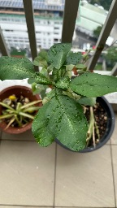
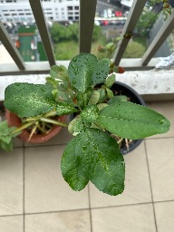

# Vanam - Data

  

**41** plant identification(s), sorted by most recently photographed.

| # | Image | Species | Confidence | Time Taken | User | Image Hash |
|---|---|---|---|---|---|---|
| 1 |  | [*Plectranthus amboinicus (Lour.) Spreng.*](identifications/4827/4827878cc3b6cd03.json) | 30.1% | 2026-05-13 07:18 UTC | `1bi07e4` | [`4827878cc3b6cd03`](images/4827/4827878cc3b6cd03.png) |
| 2 |  | [*Chlorophytum comosum (Thunb.) Jacques*](identifications/4610/46106a8bdea07c86.json) | 11.9% | 2026-05-13 07:18 UTC | `1bi07e4` | [`46106a8bdea07c86`](images/4610/46106a8bdea07c86.png) |
| 3 |  | [*Capsicum annuum L.*](identifications/5b57/5b57189ecb0e2025.json) | 9.3% | 2026-05-13 07:18 UTC | `1bi07e4` | [`5b57189ecb0e2025`](images/5b57/5b57189ecb0e2025.png) |
| 4 |  | [*Amaranthus blitum L.*](identifications/1fcb/1fcbea0815bdf680.json) | 7.9% | 2026-05-13 07:18 UTC | `1bi07e4` | [`1fcbea0815bdf680`](images/1fcb/1fcbea0815bdf680.png) |
| 5 |  | [*Tripolium pannonicum (Jacq.) Dobrocz.*](identifications/bf55/bf555cf89e04a9c8.json) | 1.5% | 2026-05-13 07:07 UTC | `06qahco` | [`bf555cf89e04a9c8`](images/bf55/bf555cf89e04a9c8.png) |
| 6 |  | [*Psidium guajava L.*](identifications/859e/859e87d6074390d2.json) | 89.7% | 2026-05-13 05:02 UTC | `9f6fcdc6` | [`859e87d6074390d2`](images/859e/859e87d6074390d2.png) |
| 7 |  | [*Artocarpus heterophyllus Lam.*](identifications/d67c/d67c2096ab66b15c.json) | 91.6% | 2026-05-13 04:19 UTC | `9f6fcdc6` | [`d67c2096ab66b15c`](images/d67c/d67c2096ab66b15c.png) |
| 8 |  | [*Artocarpus heterophyllus Lam.*](identifications/aa88/aa88bdf31955c239.json) | 93.1% | 2026-05-11 01:45 UTC | `4c5bc7a0` | [`aa88bdf31955c239`](images/aa88/aa88bdf31955c239.png) |
| 9 |  | [*Physostegia virginiana (L.) Benth.*](identifications/592e/592e30fc7278ab3b.json) | 35.9% | 2026-04-30 01:57 UTC | `e1776bd6` | [`592e30fc7278ab3b`](images/592e/592e30fc7278ab3b.png) |
| 10 |  | [*Castanea sativa Mill.*](identifications/6044/60448bd4f2a7a71f.json) | 62.6% | 2026-04-04 06:07 UTC | `e1776bd6` | [`60448bd4f2a7a71f`](images/6044/60448bd4f2a7a71f.png) |
| 11 |  | [*Eranthemum pulchellum Andrews*](identifications/9477/9477aa8de53c1b89.json) | 38.9% | 2026-04-04 04:35 UTC | `e1776bd6` | [`9477aa8de53c1b89`](images/9477/9477aa8de53c1b89.png) |
| 12 |  | [*Ecbolium viride (Forssk.) Alston*](identifications/e94b/e94b60e80f7811b0.json) | 54.1% | 2026-04-04 04:35 UTC | `e1776bd6` | [`e94b60e80f7811b0`](images/e94b/e94b60e80f7811b0.png) |
| 13 |  | [*Eranthemum pulchellum Andrews*](identifications/e3e7/e3e766b4de3e1dbc.json) | 30.5% | 2026-04-04 04:35 UTC | `e1776bd6` | [`e3e766b4de3e1dbc`](images/e3e7/e3e766b4de3e1dbc.png) |
| 14 |  | [*Leucospermum cordifolium Fourc.*](identifications/f3ec/f3ecf71f799b6ea0.json) | 29.8% | 2026-03-07 06:13 UTC | `1bi07e4` | [`f3ecf71f799b6ea0`](images/f3ec/f3ecf71f799b6ea0.png) |
| 15 |  | [*Oxalis pes-caprae L.*](identifications/ee51/ee5180b5a108b2ce.json) | 78.1% | 2026-03-07 06:13 UTC | `1bi07e4` | [`ee5180b5a108b2ce`](images/ee51/ee5180b5a108b2ce.png) |
| 16 |  | [*Rhododendron periclymenoides (Michx.) Shinners*](identifications/bbce/bbce6e14c50c56ad.json) | 58.2% | 2026-03-07 06:11 UTC | `1bi07e4` | [`bbce6e14c50c56ad`](images/bbce/bbce6e14c50c56ad.png) |
| 17 |  | [*Rhododendron ferrugineum L.*](identifications/01b7/01b73bbefdca4e74.json) | 26.5% | 2026-03-07 05:54 UTC | `1bi07e4` | [`01b73bbefdca4e74`](images/01b7/01b73bbefdca4e74.png) |
| 18 |  | [*Barringtonia asiatica (L.) Kurz*](identifications/019f/019f57b122aa24dc.json) | 90.4% | 2025-05-31 02:37 UTC | `1bi07e4` | [`019f57b122aa24dc`](images/019f/019f57b122aa24dc.png) |
| 19 |  | [*Gomphrena serrata L.*](identifications/ac9f/ac9f718463cec3ba.json) | 44.0% | 2025-05-31 02:29 UTC | `1bi07e4` | [`ac9f718463cec3ba`](images/ac9f/ac9f718463cec3ba.png) |
| 20 |  | [*Magnolia liliiflora Desr.*](identifications/5881/5881fec13ce62150.json) | 51.9% | 2025-02-06 08:46 UTC | `1bi07e4` | [`5881fec13ce62150`](images/5881/5881fec13ce62150.png) |
| 21 |  | [*Laurus nobilis L.*](identifications/2ac7/2ac715e9b5b6f5a7.json) | 34.7% | 2025-01-26 11:03 UTC | `1bi07e4` | [`2ac715e9b5b6f5a7`](images/2ac7/2ac715e9b5b6f5a7.png) |
| 22 |  | [*Camellia japonica L.*](identifications/e113/e11382d83c315de1.json) | 41.0% | 2025-01-26 07:10 UTC | `1bi07e4` | [`e11382d83c315de1`](images/e113/e11382d83c315de1.png) |
| 23 |  | [*Camellia japonica L.*](identifications/b4ea/b4ea0e78a2f0f3db.json) | 61.3% | 2025-01-26 07:10 UTC | `1bi07e4` | [`b4ea0e78a2f0f3db`](images/b4ea/b4ea0e78a2f0f3db.png) |
| 24 |  | [*Camellia japonica L.*](identifications/7e4f/7e4f1232dcf19251.json) | 40.4% | 2025-01-26 07:02 UTC | `1bi07e4` | [`7e4f1232dcf19251`](images/7e4f/7e4f1232dcf19251.png) |
| 25 |  | [*Hymenocallis littoralis (Jacq.) Salisb.*](identifications/663a/663afd2517de2239.json) | 39.9% | 2024-12-01 04:06 UTC | `1bi07e4` | [`663afd2517de2239`](images/663a/663afd2517de2239.png) |
| 26 |  | [*Costus spiralis (Jacq.) Roscoe*](identifications/26e7/26e7abcaddf2778d.json) | 61.4% | 2024-12-01 04:05 UTC | `1bi07e4` | [`26e7abcaddf2778d`](images/26e7/26e7abcaddf2778d.png) |
| 27 |  | [*Cleome viscosa L.*](identifications/4633/4633aed3d77e0c87.json) | 89.1% | 2024-12-01 04:03 UTC | `1bi07e4` | [`4633aed3d77e0c87`](images/4633/4633aed3d77e0c87.png) |
| 28 |  | [*Cleome viscosa L.*](identifications/beb2/beb25600caae8f6a.json) | 85.5% | 2024-12-01 04:03 UTC | `1bi07e4` | [`beb25600caae8f6a`](images/beb2/beb25600caae8f6a.png) |
| 29 |  | [*Cleome viscosa L.*](identifications/5007/500770bee6e6f06e.json) | 79.9% | 2024-12-01 04:03 UTC | `1bi07e4` | [`500770bee6e6f06e`](images/5007/500770bee6e6f06e.png) |
| 30 |  | [*Rorippa sylvestris (L.) Besser*](identifications/35bf/35bf6db29dc600f9.json) | 23.9% | 2024-12-01 04:02 UTC | `1bi07e4` | [`35bf6db29dc600f9`](images/35bf/35bf6db29dc600f9.png) |
| 31 |  | [*Plumeria obtusa L.*](identifications/42f6/42f6b514b94fc56b.json) | 34.3% | 2024-12-01 04:00 UTC | `1bi07e4` | [`42f6b514b94fc56b`](images/42f6/42f6b514b94fc56b.png) |
| 32 |  | [*Tagetes erecta L.*](identifications/3254/3254f6dbb52c52a5.json) | 86.4% | 2024-12-01 04:00 UTC | `1bi07e4` | [`3254f6dbb52c52a5`](images/3254/3254f6dbb52c52a5.png) |
| 33 |  | [*Heliconia bihai (L.) L.*](identifications/f662/f662782edadfe9bf.json) | 39.6% | 2024-12-01 04:00 UTC | `1bi07e4` | [`f662782edadfe9bf`](images/f662/f662782edadfe9bf.png) |
| 34 |  | [*Ficus lyrata Warb.*](identifications/0b45/0b45537b1d03c88a.json) | 67.3% | 2024-12-01 03:59 UTC | `1bi07e4` | [`0b45537b1d03c88a`](images/0b45/0b45537b1d03c88a.png) |
| 35 |  | [*Bougainvillea spectabilis Willd.*](identifications/13b4/13b4b20ab482edd5.json) | 56.8% | 2024-12-01 03:57 UTC | `1bi07e4` | [`13b4b20ab482edd5`](images/13b4/13b4b20ab482edd5.png) |
| 36 |  | [*Zinnia peruviana (L.) L.*](identifications/4783/4783a44e351751e5.json) | 56.0% | 2024-12-01 03:57 UTC | `1bi07e4` | [`4783a44e351751e5`](images/4783/4783a44e351751e5.png) |
| 37 |  | [*Tabernaemontana divaricata (L.) R.Br. ex Roem. & Schult.*](identifications/d494/d49465fcb9afe2e0.json) | 90.3% | 2024-12-01 03:57 UTC | `1bi07e4` | [`d49465fcb9afe2e0`](images/d494/d49465fcb9afe2e0.png) |
| 38 |  | [*Echinops exaltatus Schrad.*](identifications/b112/b112a5bfdd527998.json) | 62.3% | 2023-10-18 08:05 UTC | `1bi07e4` | [`b112a5bfdd527998`](images/b112/b112a5bfdd527998.png) |
| 39 |  | [*Crinum moorei Hook.f.*](identifications/b8ad/b8ad9be301563966.json) | 61.0% | 2023-10-18 07:39 UTC | `1bi07e4` | [`b8ad9be301563966`](images/b8ad/b8ad9be301563966.png) |
| 40 |  | [*Bougainvillea spectabilis Willd.*](identifications/3a7b/3a7b5f729e42e61e.json) | 62.9% | 2023-10-01 03:37 UTC | `1bi07e4` | [`3a7b5f729e42e61e`](images/3a7b/3a7b5f729e42e61e.png) |
| 41 |  | [*Alysicarpus vaginalis (L.) DC.*](identifications/e56b/e56bf4cb053f23c6.json) | 92.9% | 2023-10-01 03:36 UTC | `1bi07e4` | [`e56bf4cb053f23c6`](images/e56b/e56bf4cb053f23c6.png) |

---

    
