# Vanam - Data

  

**126** plant identification(s), sorted by most recently photographed.

| # | Image | Species | Confidence | Time Taken | User | Image Hash |
|---|---|---|---|---|---|---|
| 1 | <a href="images/138d/138d63563dc10e0a.png">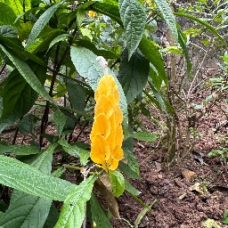</a> | [*Pachystachys lutea Nees*](identifications/138d/138d63563dc10e0a.json) | 87.6% | 2026-05-31 05:15 UTC | `1koj6ac` | [`138d63563dc10e0a`](images/138d/138d63563dc10e0a.png) |
| 2 | <a href="images/04a8/04a8009fd6d75774.png">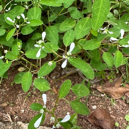</a> | [*Euphorbia hypericifolia L.*](identifications/04a8/04a8009fd6d75774.json) | 84.2% | 2026-05-31 05:14 UTC | `1koj6ac` | [`04a8009fd6d75774`](images/04a8/04a8009fd6d75774.png) |
| 3 | <a href="images/cfc1/cfc1adfe52641c33.png">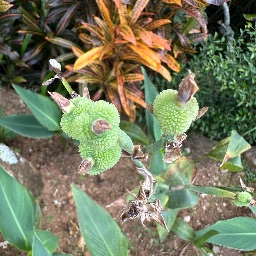</a> | [*Canna indica L.*](identifications/cfc1/cfc1adfe52641c33.json) | 74.9% | 2026-05-31 05:13 UTC | `1koj6ac` | [`cfc1adfe52641c33`](images/cfc1/cfc1adfe52641c33.png) |
| 4 | <a href="images/91db/91db4368445c2189.png">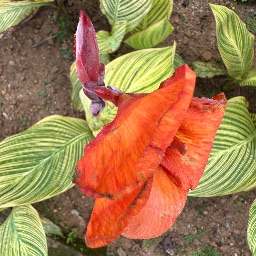</a> | [*Canna indica L.*](identifications/91db/91db4368445c2189.json) | 58.6% | 2026-05-31 05:13 UTC | `1koj6ac` | [`91db4368445c2189`](images/91db/91db4368445c2189.png) |
| 5 | <a href="images/dcf5/dcf5648a341791cf.png">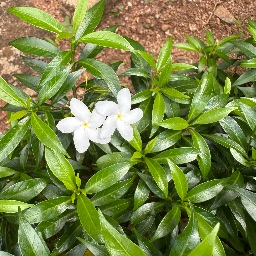</a> | [*Tabernaemontana divaricata (L.) R.Br. ex Roem. & Schult.*](identifications/dcf5/dcf5648a341791cf.json) | 89.9% | 2026-05-31 05:12 UTC | `1koj6ac` | [`dcf5648a341791cf`](images/dcf5/dcf5648a341791cf.png) |
| 6 | <a href="images/b4c2/b4c23da62810bc7c.png">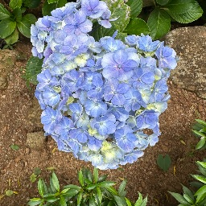</a> | [*Hydrangea macrophylla (Thunb.) Ser.*](identifications/b4c2/b4c23da62810bc7c.json) | 77.5% | 2026-05-31 05:12 UTC | `1koj6ac` | [`b4c23da62810bc7c`](images/b4c2/b4c23da62810bc7c.png) |
| 7 | <a href="images/e19b/e19b216a723200cd.png">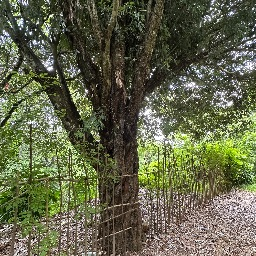</a> | [*Quercus suber L.*](identifications/e19b/e19b216a723200cd.json) | 13.5% | 2026-05-31 05:07 UTC | `1koj6ac` | [`e19b216a723200cd`](images/e19b/e19b216a723200cd.png) |
| 8 | <a href="images/0b7f/0b7fc096b03a9cf9.png">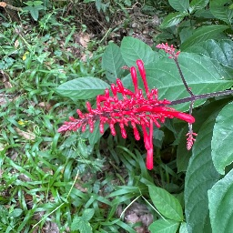</a> | [*Odontonema cuspidatum (Nees) Kuntze*](identifications/0b7f/0b7fc096b03a9cf9.json) | 83.8% | 2026-05-31 05:06 UTC | `1koj6ac` | [`0b7fc096b03a9cf9`](images/0b7f/0b7fc096b03a9cf9.png) |
| 9 | <a href="images/c386/c386ca0035f9025f.png">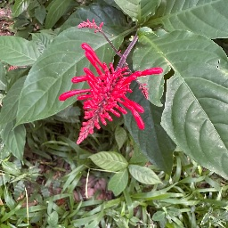</a> | [*Odontonema cuspidatum (Nees) Kuntze*](identifications/c386/c386ca0035f9025f.json) | 77.1% | 2026-05-31 05:02 UTC | `1koj6ac` | [`c386ca0035f9025f`](images/c386/c386ca0035f9025f.png) |
| 10 | <a href="images/22ad/22ad0fec46fc1ef0.png">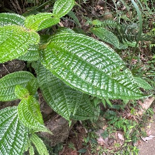</a> | [*Miconia crenata (Vahl) Michelang.*](identifications/22ad/22ad0fec46fc1ef0.json) | 90.3% | 2026-05-31 05:01 UTC | `1koj6ac` | [`22ad0fec46fc1ef0`](images/22ad/22ad0fec46fc1ef0.png) |
| 11 | <a href="images/d767/d767b80605969b31.png">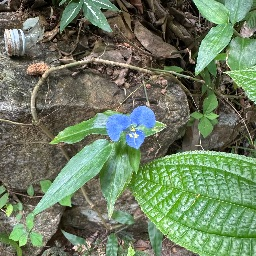</a> | [*Commelina erecta L.*](identifications/d767/d767b80605969b31.json) | 22.7% | 2026-05-31 05:01 UTC | `1koj6ac` | [`d767b80605969b31`](images/d767/d767b80605969b31.png) |
| 12 | <a href="images/b828/b8286028cead0ca9.png">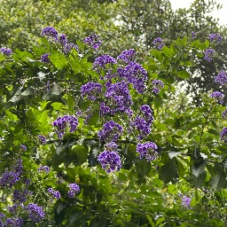</a> | [*Duranta erecta L.*](identifications/b828/b8286028cead0ca9.json) | 52.4% | 2026-05-31 05:00 UTC | `1koj6ac` | [`b8286028cead0ca9`](images/b828/b8286028cead0ca9.png) |
| 13 | <a href="images/280e/280e0ba78cd0824d.png">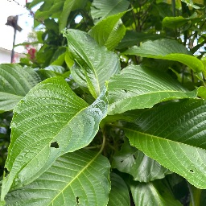</a> | [*Megaskepasma erythrochlamys Lindau*](identifications/280e/280e0ba78cd0824d.json) | 91.0% | 2026-05-31 04:59 UTC | `1koj6ac` | [`280e0ba78cd0824d`](images/280e/280e0ba78cd0824d.png) |
| 14 | <a href="images/a29b/a29bc2f2a2937f82.png">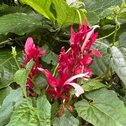</a> | [*Megaskepasma erythrochlamys Lindau*](identifications/a29b/a29bc2f2a2937f82.json) | 17.3% | 2026-05-31 04:59 UTC | `1koj6ac` | [`a29bc2f2a2937f82`](images/a29b/a29bc2f2a2937f82.png) |
| 15 | <a href="images/fcf2/fcf2c49e5ab566e2.png">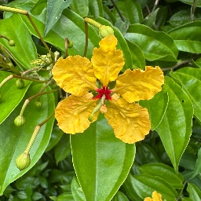</a> | [*Phanera kockiana (Korth.) Benth.*](identifications/fcf2/fcf2c49e5ab566e2.json) | 54.6% | 2026-05-31 04:58 UTC | `1koj6ac` | [`fcf2c49e5ab566e2`](images/fcf2/fcf2c49e5ab566e2.png) |
| 16 | <a href="images/2c1d/2c1d75640da7ad02.png">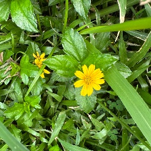</a> | [*Sphagneticola trilobata (L.) Pruski*](identifications/2c1d/2c1d75640da7ad02.json) | 95.6% | 2026-05-31 04:58 UTC | `1koj6ac` | [`2c1d75640da7ad02`](images/2c1d/2c1d75640da7ad02.png) |
| 17 | <a href="images/4475/4475940207e2041e.png">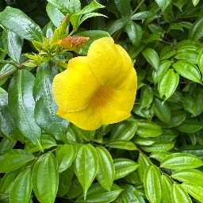</a> | [*Allamanda cathartica L.*](identifications/4475/4475940207e2041e.json) | 83.3% | 2026-05-31 04:58 UTC | `1koj6ac` | [`4475940207e2041e`](images/4475/4475940207e2041e.png) |
| 18 | <a href="images/1e1e/1e1eb87bb74e8e4b.png">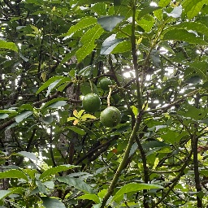</a> | [*Persea americana Mill.*](identifications/1e1e/1e1eb87bb74e8e4b.json) | 82.4% | 2026-05-31 04:57 UTC | `1koj6ac` | [`1e1eb87bb74e8e4b`](images/1e1e/1e1eb87bb74e8e4b.png) |
| 19 | <a href="images/9d14/9d1463304a488b33.png">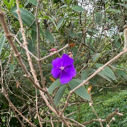</a> | [*Tibouchina urvilleana (DC.) Cogn.*](identifications/9d14/9d1463304a488b33.json) | 53.4% | 2026-05-31 04:51 UTC | `1koj6ac` | [`9d1463304a488b33`](images/9d14/9d1463304a488b33.png) |
| 20 | <a href="images/11ec/11ec3e6be7aef35c.png">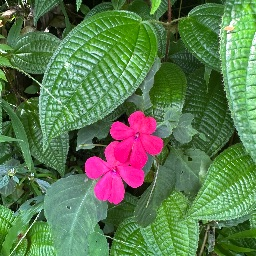</a> | [*Impatiens flaccida Arn.*](identifications/11ec/11ec3e6be7aef35c.json) | 36.7% | 2026-05-31 04:38 UTC | `1koj6ac` | [`11ec3e6be7aef35c`](images/11ec/11ec3e6be7aef35c.png) |
| 21 | <a href="images/6e5b/6e5b66539b15c463.png">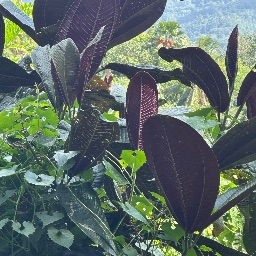</a> | [*Miconia calvescens DC.*](identifications/6e5b/6e5b66539b15c463.json) | 78.5% | 2026-05-31 04:37 UTC | `1koj6ac` | [`6e5b66539b15c463`](images/6e5b/6e5b66539b15c463.png) |
| 22 | <a href="images/7d3d/7d3d1fc16bb0956c.png">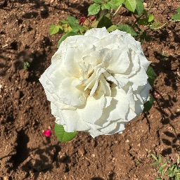</a> | [*Rosa chinensis Jacq.*](identifications/7d3d/7d3d1fc16bb0956c.json) | 34.2% | 2026-05-31 03:30 UTC | `1koj6ac` | [`7d3d1fc16bb0956c`](images/7d3d/7d3d1fc16bb0956c.png) |
| 23 | <a href="images/2e26/2e26126ce838e064.png">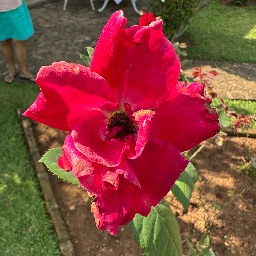</a> | [*Rosa chinensis Jacq.*](identifications/2e26/2e26126ce838e064.json) | 17.2% | 2026-05-31 03:29 UTC | `1koj6ac` | [`2e26126ce838e064`](images/2e26/2e26126ce838e064.png) |
| 24 | <a href="images/0f9f/0f9f9030665b3cc4.png">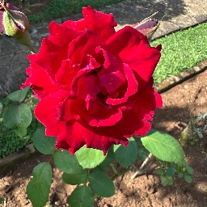</a> | [*Rosa chinensis Jacq.*](identifications/0f9f/0f9f9030665b3cc4.json) | 53.5% | 2026-05-31 03:29 UTC | `1koj6ac` | [`0f9f9030665b3cc4`](images/0f9f/0f9f9030665b3cc4.png) |
| 25 |  | [*Nymphaea nouchali Burm.f.*](identifications/607e/607ecec2cda9a033.json) | 87.4% | 2026-05-31 03:26 UTC | `1koj6ac` | [`607ecec2cda9a033`](images/607e/607ecec2cda9a033.png) |
| 26 | <a href="images/90d2/90d2565ff76e32b0.png">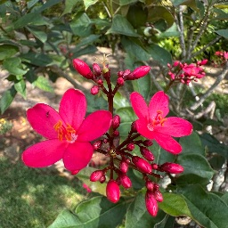</a> | [*Jatropha integerrima Jacq.*](identifications/90d2/90d2565ff76e32b0.json) | 96.2% | 2026-05-31 03:26 UTC | `1koj6ac` | [`90d2565ff76e32b0`](images/90d2/90d2565ff76e32b0.png) |
| 27 | <a href="images/2bc6/2bc6b8564ddffcd4.png">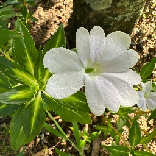</a> | [*Impatiens walleriana Hook.f.*](identifications/2bc6/2bc6b8564ddffcd4.json) | 52.6% | 2026-05-31 02:39 UTC | `1koj6ac` | [`2bc6b8564ddffcd4`](images/2bc6/2bc6b8564ddffcd4.png) |
| 28 | <a href="images/03bd/03bdfaaea141e8e7.png">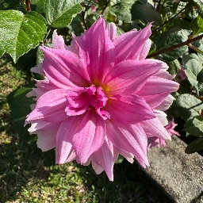</a> | [*Dahlia × hortensis Guillaumin*](identifications/03bd/03bdfaaea141e8e7.json) | 46.1% | 2026-05-31 02:39 UTC | `1koj6ac` | [`03bdfaaea141e8e7`](images/03bd/03bdfaaea141e8e7.png) |
| 29 | <a href="images/a691/a6917201d63b3da6.png">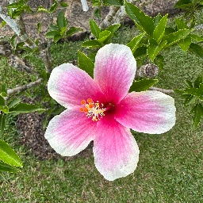</a> | [*Hibiscus rosa-sinensis L.*](identifications/a691/a6917201d63b3da6.json) | 56.5% | 2026-05-31 02:38 UTC | `1koj6ac` | [`a6917201d63b3da6`](images/a691/a6917201d63b3da6.png) |
| 30 | <a href="images/8e4f/8e4f73a241c3e736.png">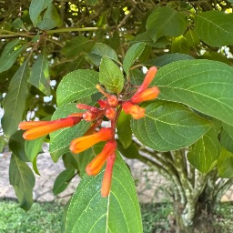</a> | [*Hamelia patens Jacq.*](identifications/8e4f/8e4f73a241c3e736.json) | 91.9% | 2026-05-31 02:38 UTC | `1koj6ac` | [`8e4f73a241c3e736`](images/8e4f/8e4f73a241c3e736.png) |
| 31 | <a href="images/d0f0/d0f071717d69ef94.png">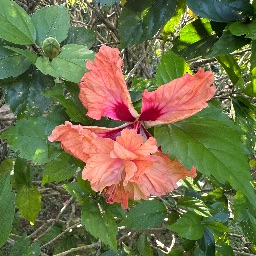</a> | [*Hibiscus spp.*](identifications/d0f0/d0f071717d69ef94.json) | 32.5% | 2026-05-31 02:38 UTC | `1koj6ac` | [`d0f071717d69ef94`](images/d0f0/d0f071717d69ef94.png) |
| 32 | <a href="images/688a/688a4d91eec22182.png">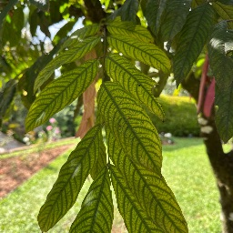</a> | [*Saraca indica L.*](identifications/688a/688a4d91eec22182.json) | 11.8% | 2026-05-30 09:55 UTC | `1bi07e4` | [`688a4d91eec22182`](images/688a/688a4d91eec22182.png) |
| 33 | <a href="images/f540/f5404cde3fde27c1.png">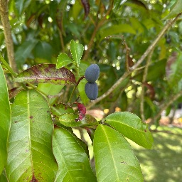</a> | [*Kopsia arborea Blume*](identifications/f540/f5404cde3fde27c1.json) | 70.7% | 2026-05-30 09:55 UTC | `1bi07e4` | [`f5404cde3fde27c1`](images/f540/f5404cde3fde27c1.png) |
| 34 | <a href="images/bc33/bc3379761098a75c.png">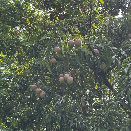</a> | [*Mangifera indica L.*](identifications/bc33/bc3379761098a75c.json) | 61.2% | 2026-05-30 09:54 UTC | `1bi07e4` | [`bc3379761098a75c`](images/bc33/bc3379761098a75c.png) |
| 35 | <a href="images/bf87/bf87d4eb47a9706d.png">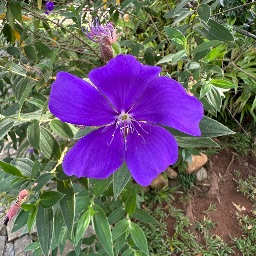</a> | [*Tibouchina urvilleana (DC.) Cogn.*](identifications/bf87/bf87d4eb47a9706d.json) | 52.5% | 2026-05-30 09:45 UTC | `1bi07e4` | [`bf87d4eb47a9706d`](images/bf87/bf87d4eb47a9706d.png) |
| 36 | <a href="images/7c71/7c7143242403d315.png">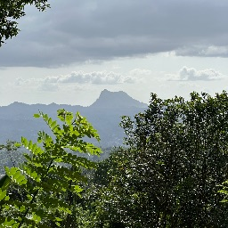</a> | [*Ailanthus altissima (Mill.) Swingle*](identifications/7c71/7c7143242403d315.json) | 17.2% | 2026-05-30 09:44 UTC | `1bi07e4` | [`7c7143242403d315`](images/7c71/7c7143242403d315.png) |
| 37 | <a href="images/144d/144ddb892e41769d.png">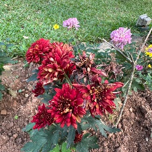</a> | [*Chrysanthemum × morifolium (Ramat.) Hemsl.*](identifications/144d/144ddb892e41769d.json) | 52.2% | 2026-05-30 09:40 UTC | `1bi07e4` | [`144ddb892e41769d`](images/144d/144ddb892e41769d.png) |
| 38 | <a href="images/813f/813f3ee3d9f5d12a.png">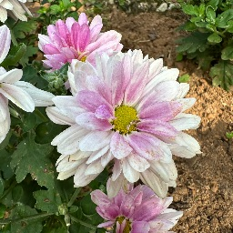</a> | [*Chrysanthemum × morifolium (Ramat.) Hemsl.*](identifications/813f/813f3ee3d9f5d12a.json) | 38.1% | 2026-05-30 09:40 UTC | `1bi07e4` | [`813f3ee3d9f5d12a`](images/813f/813f3ee3d9f5d12a.png) |
| 39 | <a href="images/17b2/17b241de23712308.png">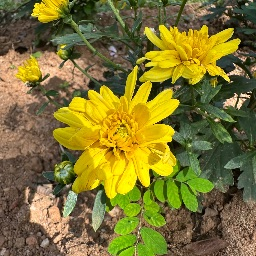</a> | [*Chrysanthemum indicum L.*](identifications/17b2/17b241de23712308.json) | 21.3% | 2026-05-30 09:40 UTC | `1bi07e4` | [`17b241de23712308`](images/17b2/17b241de23712308.png) |
| 40 | <a href="images/614b/614b1dff5cf1a3b5.png">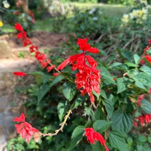</a> | [*Salvia splendens Sellow ex Schult.*](identifications/614b/614b1dff5cf1a3b5.json) | 78.1% | 2026-05-30 09:39 UTC | `1bi07e4` | [`614b1dff5cf1a3b5`](images/614b/614b1dff5cf1a3b5.png) |
| 41 | <a href="images/59ef/59ef65230591a29c.png">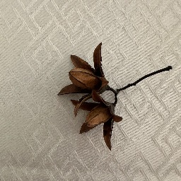</a> | [*Cedrela odorata L.*](identifications/59ef/59ef65230591a29c.json) | 50.7% | 2026-05-30 08:40 UTC | `1bi07e4` | [`59ef65230591a29c`](images/59ef/59ef65230591a29c.png) |
| 42 | <a href="images/213d/213dededab615bb2.png">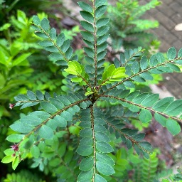</a> | [*Phyllanthus pulcher Wall. ex Müll.Arg.*](identifications/213d/213dededab615bb2.json) | 19.0% | 2026-05-14 01:35 UTC | `1bi07e4` | [`213dededab615bb2`](images/213d/213dededab615bb2.png) |
| 43 | <a href="images/ac5c/ac5cc265d1b10aa0.png">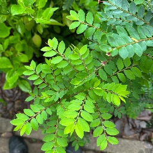</a> | [*Phyllanthus pulcher Wall. ex Müll.Arg.*](identifications/ac5c/ac5cc265d1b10aa0.json) | 19.8% | 2026-05-14 01:35 UTC | `1bi07e4` | [`ac5cc265d1b10aa0`](images/ac5c/ac5cc265d1b10aa0.png) |
| 44 | <a href="images/c83f/c83f753b7dfebd50.png">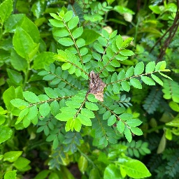</a> | [*Phyllanthus tenellus Roxb.*](identifications/c83f/c83f753b7dfebd50.json) | 15.9% | 2026-05-14 01:35 UTC | `1bi07e4` | [`c83f753b7dfebd50`](images/c83f/c83f753b7dfebd50.png) |
| 45 | <a href="images/c4ca/c4cab7f7617a0d7b.png">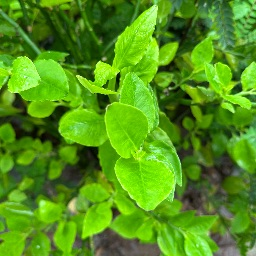</a> | [*Euphorbia tithymaloides L.*](identifications/c4ca/c4cab7f7617a0d7b.json) | 45.7% | 2026-05-14 01:34 UTC | `1bi07e4` | [`c4cab7f7617a0d7b`](images/c4ca/c4cab7f7617a0d7b.png) |
| 46 | <a href="images/c8fe/c8fe0a69dc219962.png">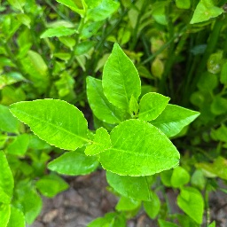</a> | [*Euphorbia tithymaloides L.*](identifications/c8fe/c8fe0a69dc219962.json) | 24.8% | 2026-05-14 01:34 UTC | `1bi07e4` | [`c8fe0a69dc219962`](images/c8fe/c8fe0a69dc219962.png) |
| 47 | <a href="images/54ab/54ab51b75d575eff.png">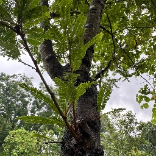</a> | [*Phyllanthus emblica L.*](identifications/54ab/54ab51b75d575eff.json) | 14.8% | 2026-05-14 01:34 UTC | `1bi07e4` | [`54ab51b75d575eff`](images/54ab/54ab51b75d575eff.png) |
| 48 | <a href="images/55ea/55ea9b8c14aec6e8.png">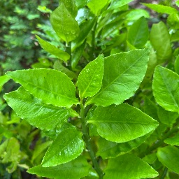</a> | [*Euphorbia tithymaloides L.*](identifications/55ea/55ea9b8c14aec6e8.json) | 52.2% | 2026-05-14 01:34 UTC | `1bi07e4` | [`55ea9b8c14aec6e8`](images/55ea/55ea9b8c14aec6e8.png) |
| 49 | <a href="images/2e85/2e859382180e6553.png">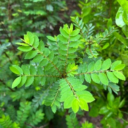</a> | [*Phyllanthus niruroides Müll.Arg.*](identifications/2e85/2e859382180e6553.json) | 11.6% | 2026-05-14 01:34 UTC | `1bi07e4` | [`2e859382180e6553`](images/2e85/2e859382180e6553.png) |
| 50 | <a href="images/df62/df623b97eab9399a.png">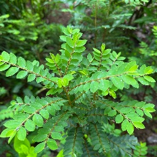</a> | [*Phyllanthus niruroides Müll.Arg.*](identifications/df62/df623b97eab9399a.json) | 16.2% | 2026-05-14 01:34 UTC | `1bi07e4` | [`df623b97eab9399a`](images/df62/df623b97eab9399a.png) |
| 51 | <a href="images/cb61/cb61f5450abe37c6.png">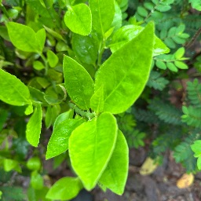</a> | [*Euphorbia tithymaloides L.*](identifications/cb61/cb61f5450abe37c6.json) | 13.7% | 2026-05-14 01:34 UTC | `1bi07e4` | [`cb61f5450abe37c6`](images/cb61/cb61f5450abe37c6.png) |
| 52 |  | [*Phyllanthus tenellus Roxb.*](identifications/f7d1/f7d14a200bacc97c.json) | 11.0% | 2026-05-14 01:34 UTC | `1bi07e4` | [`f7d14a200bacc97c`](images/f7d1/f7d14a200bacc97c.png) |
| 53 |  | [*Euphorbia tithymaloides L.*](identifications/b9fb/b9fb344a38edbe4f.json) | 81.1% | 2026-05-14 01:34 UTC | `1bi07e4` | [`b9fb344a38edbe4f`](images/b9fb/b9fb344a38edbe4f.png) |
| 54 |  | [*Euphorbia tithymaloides L.*](identifications/31b2/31b2c84d9f62b236.json) | 82.1% | 2026-05-14 01:34 UTC | `1bi07e4` | [`31b2c84d9f62b236`](images/31b2/31b2c84d9f62b236.png) |
| 55 |  | [*Euphorbia tithymaloides L.*](identifications/5bfa/5bfa3cfd9aa6d6c9.json) | 69.6% | 2026-05-14 01:34 UTC | `1bi07e4` | [`5bfa3cfd9aa6d6c9`](images/5bfa/5bfa3cfd9aa6d6c9.png) |
| 56 |  | [*Euphorbia tithymaloides L.*](identifications/4afa/4afa8d459800d84f.json) | 71.3% | 2026-05-14 01:33 UTC | `1bi07e4` | [`4afa8d459800d84f`](images/4afa/4afa8d459800d84f.png) |
| 57 |  | [*Indigofera tinctoria L.*](identifications/8df7/8df7caa24100f793.json) | 20.1% | 2026-05-14 01:33 UTC | `1bi07e4` | [`8df7caa24100f793`](images/8df7/8df7caa24100f793.png) |
| 58 |  | [*Indigofera tinctoria L.*](identifications/aa89/aa89e163e720411d.json) | 16.8% | 2026-05-14 01:33 UTC | `1bi07e4` | [`aa89e163e720411d`](images/aa89/aa89e163e720411d.png) |
| 59 |  | [*Euphorbia tithymaloides L.*](identifications/81fd/81fd49ac5f8bbe5c.json) | 31.5% | 2026-05-14 01:33 UTC | `1bi07e4` | [`81fd49ac5f8bbe5c`](images/81fd/81fd49ac5f8bbe5c.png) |
| 60 |  | [*Barleria cristata L.*](identifications/3b3d/3b3d1dfb2ec57564.json) | 11.9% | 2026-05-14 01:33 UTC | `1bi07e4` | [`3b3d1dfb2ec57564`](images/3b3d/3b3d1dfb2ec57564.png) |
| 61 |  | [*Euphorbia tithymaloides L.*](identifications/24cb/24cbf2290afad730.json) | 77.5% | 2026-05-14 01:33 UTC | `1bi07e4` | [`24cbf2290afad730`](images/24cb/24cbf2290afad730.png) |
| 62 |  | [*Euphorbia tithymaloides L.*](identifications/fa0b/fa0b575a1524e54e.json) | 98.1% | 2026-05-14 01:33 UTC | `1bi07e4` | [`fa0b575a1524e54e`](images/fa0b/fa0b575a1524e54e.png) |
| 63 |  | [*Gynura procumbens (Lour.) Merr.*](identifications/2ef1/2ef1ca46bb4adcc5.json) | 26.8% | 2026-05-14 01:32 UTC | `1bi07e4` | [`2ef1ca46bb4adcc5`](images/2ef1/2ef1ca46bb4adcc5.png) |
| 64 |  | [*Euphorbia tithymaloides L.*](identifications/5bdc/5bdc06925eb4692e.json) | 85.7% | 2026-05-14 01:32 UTC | `1bi07e4` | [`5bdc06925eb4692e`](images/5bdc/5bdc06925eb4692e.png) |
| 65 |  | [*Euphorbia tithymaloides L.*](identifications/f56c/f56ce6f1ec6dee31.json) | 79.7% | 2026-05-14 01:32 UTC | `1bi07e4` | [`f56ce6f1ec6dee31`](images/f56c/f56ce6f1ec6dee31.png) |
| 66 |  | [*Euphorbia tithymaloides L.*](identifications/bd9d/bd9d09ce3795e0e4.json) | 90.4% | 2026-05-14 01:32 UTC | `1bi07e4` | [`bd9d09ce3795e0e4`](images/bd9d/bd9d09ce3795e0e4.png) |
| 67 |  | [*Euphorbia tithymaloides L.*](identifications/4121/4121bca8e382be50.json) | 94.2% | 2026-05-14 01:32 UTC | `1bi07e4` | [`4121bca8e382be50`](images/4121/4121bca8e382be50.png) |
| 68 |  | [*Euphorbia tithymaloides L.*](identifications/a5cd/a5cd0676a5a3b86b.json) | 20.7% | 2026-05-14 01:32 UTC | `1bi07e4` | [`a5cd0676a5a3b86b`](images/a5cd/a5cd0676a5a3b86b.png) |
| 69 |  | [*Euphorbia tithymaloides L.*](identifications/aa0d/aa0d1b1906c30ea2.json) | 89.8% | 2026-05-14 01:32 UTC | `1bi07e4` | [`aa0d1b1906c30ea2`](images/aa0d/aa0d1b1906c30ea2.png) |
| 70 |  | [*Euphorbia tithymaloides L.*](identifications/13d7/13d73d7c7d59a8c3.json) | 81.1% | 2026-05-14 01:32 UTC | `1bi07e4` | [`13d73d7c7d59a8c3`](images/13d7/13d73d7c7d59a8c3.png) |
| 71 |  | [*Euphorbia tithymaloides L.*](identifications/ebb4/ebb48c9a17b0a1db.json) | 93.9% | 2026-05-14 01:32 UTC | `1bi07e4` | [`ebb48c9a17b0a1db`](images/ebb4/ebb48c9a17b0a1db.png) |
| 72 |  | [*Euphorbia tithymaloides L.*](identifications/ea79/ea7962919bd12c3d.json) | 95.8% | 2026-05-14 01:32 UTC | `1bi07e4` | [`ea7962919bd12c3d`](images/ea79/ea7962919bd12c3d.png) |
| 73 |  | [*Euphorbia tithymaloides L.*](identifications/bd55/bd55451b2f0f430a.json) | 95.7% | 2026-05-14 01:32 UTC | `1bi07e4` | [`bd55451b2f0f430a`](images/bd55/bd55451b2f0f430a.png) |
| 74 |  | [*Justicia adhatoda L.*](identifications/60af/60af014c2b70070a.json) | 18.2% | 2026-05-14 01:31 UTC | `1bi07e4` | [`60af014c2b70070a`](images/60af/60af014c2b70070a.png) |
| 75 |  | [*Justicia adhatoda L.*](identifications/ec9a/ec9a0664d1dc3994.json) | 23.7% | 2026-05-14 01:31 UTC | `1bi07e4` | [`ec9a0664d1dc3994`](images/ec9a/ec9a0664d1dc3994.png) |
| 76 |  | [*Justicia adhatoda L.*](identifications/b568/b568c9ce96b0ebff.json) | 11.1% | 2026-05-14 01:31 UTC | `1bi07e4` | [`b568c9ce96b0ebff`](images/b568/b568c9ce96b0ebff.png) |
| 77 |  | [*Euphorbia tithymaloides L.*](identifications/3ae0/3ae050bbdb1eb9cf.json) | 94.3% | 2026-05-14 01:31 UTC | `1bi07e4` | [`3ae050bbdb1eb9cf`](images/3ae0/3ae050bbdb1eb9cf.png) |
| 78 |  | [*Nyctanthes arbor-tristis L.*](identifications/fafd/fafd93b6c99ed934.json) | 86.2% | 2026-05-14 01:31 UTC | `1bi07e4` | [`fafd93b6c99ed934`](images/fafd/fafd93b6c99ed934.png) |
| 79 |  | [*Nyctanthes arbor-tristis L.*](identifications/0230/02307dea103a929a.json) | 68.5% | 2026-05-14 01:31 UTC | `1bi07e4` | [`02307dea103a929a`](images/0230/02307dea103a929a.png) |
| 80 |  | [*Plectranthus amboinicus (Lour.) Spreng.*](identifications/4827/4827878cc3b6cd03.json) | 30.1% | 2026-05-13 07:18 UTC | `1bi07e4` | [`4827878cc3b6cd03`](images/4827/4827878cc3b6cd03.png) |
| 81 |  | [*Chlorophytum comosum (Thunb.) Jacques*](identifications/4610/46106a8bdea07c86.json) | 11.9% | 2026-05-13 07:18 UTC | `1bi07e4` | [`46106a8bdea07c86`](images/4610/46106a8bdea07c86.png) |
| 82 |  | [*Psidium guajava L.*](identifications/859e/859e87d6074390d2.json) | 89.7% | 2026-05-13 05:02 UTC | `9f6fcdc6` | [`859e87d6074390d2`](images/859e/859e87d6074390d2.png) |
| 83 |  | [*Artocarpus heterophyllus Lam.*](identifications/d67c/d67c2096ab66b15c.json) | 91.6% | 2026-05-13 04:19 UTC | `9f6fcdc6` | [`d67c2096ab66b15c`](images/d67c/d67c2096ab66b15c.png) |
| 84 |  | [*Artocarpus heterophyllus Lam.*](identifications/aa88/aa88bdf31955c239.json) | 93.1% | 2026-05-11 01:45 UTC | `4c5bc7a0` | [`aa88bdf31955c239`](images/aa88/aa88bdf31955c239.png) |
| 85 |  | [*Physostegia virginiana (L.) Benth.*](identifications/592e/592e30fc7278ab3b.json) | 35.9% | 2026-04-30 01:57 UTC | `e1776bd6` | [`592e30fc7278ab3b`](images/592e/592e30fc7278ab3b.png) |
| 86 |  | [*Castanea sativa Mill.*](identifications/6044/60448bd4f2a7a71f.json) | 62.6% | 2026-04-04 06:07 UTC | `e1776bd6` | [`60448bd4f2a7a71f`](images/6044/60448bd4f2a7a71f.png) |
| 87 |  | [*Eranthemum pulchellum Andrews*](identifications/9477/9477aa8de53c1b89.json) | 38.9% | 2026-04-04 04:35 UTC | `e1776bd6` | [`9477aa8de53c1b89`](images/9477/9477aa8de53c1b89.png) |
| 88 |  | [*Ecbolium viride (Forssk.) Alston*](identifications/e94b/e94b60e80f7811b0.json) | 54.1% | 2026-04-04 04:35 UTC | `e1776bd6` | [`e94b60e80f7811b0`](images/e94b/e94b60e80f7811b0.png) |
| 89 |  | [*Eranthemum pulchellum Andrews*](identifications/e3e7/e3e766b4de3e1dbc.json) | 30.5% | 2026-04-04 04:35 UTC | `e1776bd6` | [`e3e766b4de3e1dbc`](images/e3e7/e3e766b4de3e1dbc.png) |
| 90 |  | [*Leucospermum cordifolium Fourc.*](identifications/f3ec/f3ecf71f799b6ea0.json) | 29.8% | 2026-03-07 06:13 UTC | `1bi07e4` | [`f3ecf71f799b6ea0`](images/f3ec/f3ecf71f799b6ea0.png) |
| 91 |  | [*Oxalis pes-caprae L.*](identifications/ee51/ee5180b5a108b2ce.json) | 78.1% | 2026-03-07 06:13 UTC | `1bi07e4` | [`ee5180b5a108b2ce`](images/ee51/ee5180b5a108b2ce.png) |
| 92 |  | [*Rhododendron periclymenoides (Michx.) Shinners*](identifications/bbce/bbce6e14c50c56ad.json) | 58.2% | 2026-03-07 06:11 UTC | `1bi07e4` | [`bbce6e14c50c56ad`](images/bbce/bbce6e14c50c56ad.png) |
| 93 |  | [*Rhododendron ferrugineum L.*](identifications/01b7/01b73bbefdca4e74.json) | 26.5% | 2026-03-07 05:54 UTC | `1bi07e4` | [`01b73bbefdca4e74`](images/01b7/01b73bbefdca4e74.png) |
| 94 |  | [*Barringtonia asiatica (L.) Kurz*](identifications/019f/019f57b122aa24dc.json) | 90.4% | 2025-05-31 02:37 UTC | `1bi07e4` | [`019f57b122aa24dc`](images/019f/019f57b122aa24dc.png) |
| 95 |  | [*Gomphrena serrata L.*](identifications/ac9f/ac9f718463cec3ba.json) | 44.0% | 2025-05-31 02:29 UTC | `1bi07e4` | [`ac9f718463cec3ba`](images/ac9f/ac9f718463cec3ba.png) |
| 96 |  | [*Magnolia liliiflora Desr.*](identifications/5881/5881fec13ce62150.json) | 51.9% | 2025-02-06 08:46 UTC | `1bi07e4` | [`5881fec13ce62150`](images/5881/5881fec13ce62150.png) |
| 97 |  | [*Laurus nobilis L.*](identifications/2ac7/2ac715e9b5b6f5a7.json) | 34.7% | 2025-01-26 11:03 UTC | `1bi07e4` | [`2ac715e9b5b6f5a7`](images/2ac7/2ac715e9b5b6f5a7.png) |
| 98 |  | [*Camellia japonica L.*](identifications/e113/e11382d83c315de1.json) | 41.0% | 2025-01-26 07:10 UTC | `1bi07e4` | [`e11382d83c315de1`](images/e113/e11382d83c315de1.png) |
| 99 |  | [*Camellia japonica L.*](identifications/b4ea/b4ea0e78a2f0f3db.json) | 61.3% | 2025-01-26 07:10 UTC | `1bi07e4` | [`b4ea0e78a2f0f3db`](images/b4ea/b4ea0e78a2f0f3db.png) |
| 100 |  | [*Camellia japonica L.*](identifications/7e4f/7e4f1232dcf19251.json) | 40.4% | 2025-01-26 07:02 UTC | `1bi07e4` | [`7e4f1232dcf19251`](images/7e4f/7e4f1232dcf19251.png) |
| 101 |  | [*Hymenocallis littoralis (Jacq.) Salisb.*](identifications/663a/663afd2517de2239.json) | 39.9% | 2024-12-01 04:06 UTC | `1bi07e4` | [`663afd2517de2239`](images/663a/663afd2517de2239.png) |
| 102 |  | [*Costus spiralis (Jacq.) Roscoe*](identifications/26e7/26e7abcaddf2778d.json) | 61.4% | 2024-12-01 04:05 UTC | `1bi07e4` | [`26e7abcaddf2778d`](images/26e7/26e7abcaddf2778d.png) |
| 103 |  | [*Cleome viscosa L.*](identifications/4633/4633aed3d77e0c87.json) | 89.1% | 2024-12-01 04:03 UTC | `1bi07e4` | [`4633aed3d77e0c87`](images/4633/4633aed3d77e0c87.png) |
| 104 |  | [*Cleome viscosa L.*](identifications/beb2/beb25600caae8f6a.json) | 85.5% | 2024-12-01 04:03 UTC | `1bi07e4` | [`beb25600caae8f6a`](images/beb2/beb25600caae8f6a.png) |
| 105 |  | [*Cleome viscosa L.*](identifications/5007/500770bee6e6f06e.json) | 79.9% | 2024-12-01 04:03 UTC | `1bi07e4` | [`500770bee6e6f06e`](images/5007/500770bee6e6f06e.png) |
| 106 |  | [*Rorippa sylvestris (L.) Besser*](identifications/35bf/35bf6db29dc600f9.json) | 23.9% | 2024-12-01 04:02 UTC | `1bi07e4` | [`35bf6db29dc600f9`](images/35bf/35bf6db29dc600f9.png) |
| 107 |  | [*Plumeria obtusa L.*](identifications/42f6/42f6b514b94fc56b.json) | 34.3% | 2024-12-01 04:00 UTC | `1bi07e4` | [`42f6b514b94fc56b`](images/42f6/42f6b514b94fc56b.png) |
| 108 |  | [*Tagetes erecta L.*](identifications/3254/3254f6dbb52c52a5.json) | 86.4% | 2024-12-01 04:00 UTC | `1bi07e4` | [`3254f6dbb52c52a5`](images/3254/3254f6dbb52c52a5.png) |
| 109 |  | [*Heliconia bihai (L.) L.*](identifications/f662/f662782edadfe9bf.json) | 39.6% | 2024-12-01 04:00 UTC | `1bi07e4` | [`f662782edadfe9bf`](images/f662/f662782edadfe9bf.png) |
| 110 |  | [*Ficus lyrata Warb.*](identifications/0b45/0b45537b1d03c88a.json) | 67.3% | 2024-12-01 03:59 UTC | `1bi07e4` | [`0b45537b1d03c88a`](images/0b45/0b45537b1d03c88a.png) |
| 111 |  | [*Bougainvillea spectabilis Willd.*](identifications/13b4/13b4b20ab482edd5.json) | 56.8% | 2024-12-01 03:57 UTC | `1bi07e4` | [`13b4b20ab482edd5`](images/13b4/13b4b20ab482edd5.png) |
| 112 |  | [*Zinnia peruviana (L.) L.*](identifications/4783/4783a44e351751e5.json) | 56.0% | 2024-12-01 03:57 UTC | `1bi07e4` | [`4783a44e351751e5`](images/4783/4783a44e351751e5.png) |
| 113 |  | [*Tabernaemontana divaricata (L.) R.Br. ex Roem. & Schult.*](identifications/d494/d49465fcb9afe2e0.json) | 90.3% | 2024-12-01 03:57 UTC | `1bi07e4` | [`d49465fcb9afe2e0`](images/d494/d49465fcb9afe2e0.png) |
| 114 |  | [*Echinops exaltatus Schrad.*](identifications/b112/b112a5bfdd527998.json) | 62.3% | 2023-10-18 08:05 UTC | `1bi07e4` | [`b112a5bfdd527998`](images/b112/b112a5bfdd527998.png) |
| 115 |  | [*Crinum moorei Hook.f.*](identifications/b8ad/b8ad9be301563966.json) | 61.0% | 2023-10-18 07:39 UTC | `1bi07e4` | [`b8ad9be301563966`](images/b8ad/b8ad9be301563966.png) |
| 116 |  | [*Bougainvillea spectabilis Willd.*](identifications/3a7b/3a7b5f729e42e61e.json) | 62.9% | 2023-10-01 03:37 UTC | `1bi07e4` | [`3a7b5f729e42e61e`](images/3a7b/3a7b5f729e42e61e.png) |
| 117 |  | [*Alysicarpus vaginalis (L.) DC.*](identifications/e56b/e56bf4cb053f23c6.json) | 92.9% | 2023-10-01 03:36 UTC | `1bi07e4` | [`e56bf4cb053f23c6`](images/e56b/e56bf4cb053f23c6.png) |
| 118 |  | [*Malus hupehensis (Pamp.) Rehder*](identifications/59f7/59f7f20e8fd65500.json) | 20.6% | 2023-07-20 09:06 UTC | `1bi07e4` | [`59f7f20e8fd65500`](images/59f7/59f7f20e8fd65500.png) |
| 119 |  | [*Cirsium vulgare (Savi) Ten.*](identifications/d67b/d67b8838336afd07.json) | 87.0% | 2023-07-19 08:02 UTC | `1bi07e4` | [`d67b8838336afd07`](images/d67b/d67b8838336afd07.png) |
| 120 |  | [*Calystegia sepium (L.) R.Br.*](identifications/c6c4/c6c4b3a045893055.json) | 35.5% | 2023-07-19 08:00 UTC | `1bi07e4` | [`c6c4b3a045893055`](images/c6c4/c6c4b3a045893055.png) |
| 121 |  | [*Populus nigra L.*](identifications/b0e3/b0e3a6cd50db0815.json) | 62.6% | 2023-07-19 07:37 UTC | `1bi07e4` | [`b0e3a6cd50db0815`](images/b0e3/b0e3a6cd50db0815.png) |
| 122 |  | [*Artocarpus heterophyllus Lam.*](identifications/2f54/2f54f1d12f691001.json) | 43.4% | 2023-07-16 08:33 UTC | `1bi07e4` | [`2f54f1d12f691001`](images/2f54/2f54f1d12f691001.png) |
| 123 |  | [*Rosa chinensis Jacq.*](identifications/6df8/6df8558be0fac10b.json) | 24.7% | 2023-07-13 01:55 UTC | `1bi07e4` | [`6df8558be0fac10b`](images/6df8/6df8558be0fac10b.png) |
| 124 |  | [*Alcea rosea L.*](identifications/df3c/df3ce15a4da1a2ad.json) | 79.7% | 2022-09-21 09:35 UTC | `1bi07e4` | [`df3ce15a4da1a2ad`](images/df3c/df3ce15a4da1a2ad.png) |
| 125 |  | [*Punica granatum L.*](identifications/b20c/b20c18d33feb6010.json) | 98.4% | 2022-09-21 09:31 UTC | `1bi07e4` | [`b20c18d33feb6010`](images/b20c/b20c18d33feb6010.png) |
| 126 |  | [*Armeria maritima (Mill.) Willd.*](identifications/be20/be209a8472559587.json) | 23.9% | 2017-05-29 12:23 UTC | `1bi07e4` | [`be209a8472559587`](images/be20/be209a8472559587.png) |

---

    
